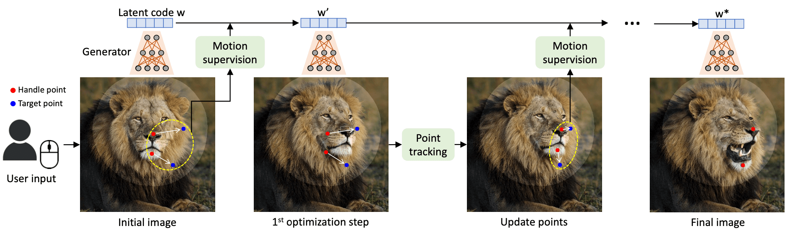
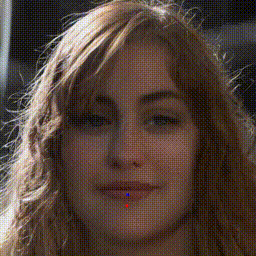
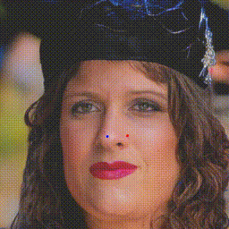
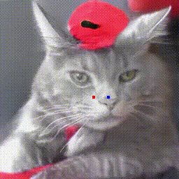
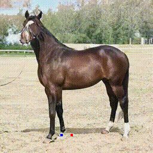

# DragGAN

:boom:  [`Colab Demo`](https://colab.research.google.com/github/Zeqiang-Lai/DragGAN/blob/master/colab.ipynb) | [`InternGPT Free Online Demo`](https://github.com/OpenGVLab/InternGPT)
<!--  [`Online Demo`](https://6a05f355a8f139550c.gradio.live/)  -->
<!-- > Note that the link of online demo will be updated regularly. -->

> **An out-of-box online demo is integrated in [InternGPT](https://github.com/OpenGVLab/InternGPT) - a super cool pointing-language-driven visual interactive system. Enjoy for free.:lollipop:**
> 
> Note for Colab, remember to select a GPU via `Runtime/Change runtime type` (`代码执行程序/更改运行时类型`).
> 
> Due to the limitation of GAN inversion, it is possible that your custom images are distorted. Besides, it is also possible the manipulations fail due to the limitation of our implementation.

Unofficial implementation of [Drag Your GAN: Interactive Point-based Manipulation on the Generative Image Manifold](https://vcai.mpi-inf.mpg.de/projects/DragGAN/)



:star2: **Updates**

This project is now a sub-project of [InternGPT](https://github.com/OpenGVLab/InternGPT) for interactive image editing. Future updates of more cool tools beyond DragGAN would be added in [InternGPT](https://github.com/OpenGVLab/InternGPT). 

- [ ] Tweak performance.
- [ ] Automatically determining the number of iterations.
- [x] Integrate into [InternGPT](https://github.com/OpenGVLab/InternGPT)
- [x] Custom Image with GAN inversion.
- [x] Download generated image and generation trajectory.
- [x] Controlling generation process with GUI.
- [x] Automatically download stylegan2 checkpoint.
- [x] Support movable region, multiple handle points.
- [x] Gradio and Colab Demo.


## Demo

Results of our implementation. 

<p float="left">
  
   
  
  
</p>

https://github.com/Zeqiang-Lai/DragGAN/assets/26198430/f1516101-5667-4f73-9330-57fc45754283


## Usage

Ensure you have a GPU and [PyTorch](https://pytorch.org/get-started/locally/), [Gradio](https://gradio.app/quickstart/) installed. You could install all the requirements via,

```bash
pip install -r requirements.txt
```

Launch the Gradio demo

```
python gradio_app.py
```

> If you have any issue for downloading the checkpoint, you could manually download it from [here](https://huggingface.co/aaronb/StyleGAN2/tree/main) and put it into the folder `checkpoints`.

## Acknowledgement

[Official DragGAN](https://github.com/XingangPan/DragGAN) &ensp; [StyleGAN2](https://github.com/NVlabs/stylegan2)  &ensp; [StyleGAN2-pytorch](https://github.com/rosinality/stylegan2-pytorch)

<!-- https://github.com/omertov/encoder4editing -->

## Citation

```bibtex
@inproceedings{pan2023draggan,
    title={Drag Your GAN: Interactive Point-based Manipulation on the Generative Image Manifold}, 
    author={Pan, Xingang and Tewari, Ayush, and Leimk{\"u}hler, Thomas and Liu, Lingjie and Meka, Abhimitra and Theobalt, Christian},
    booktitle = {ACM SIGGRAPH 2023 Conference Proceedings},
    year={2023}
}
```
